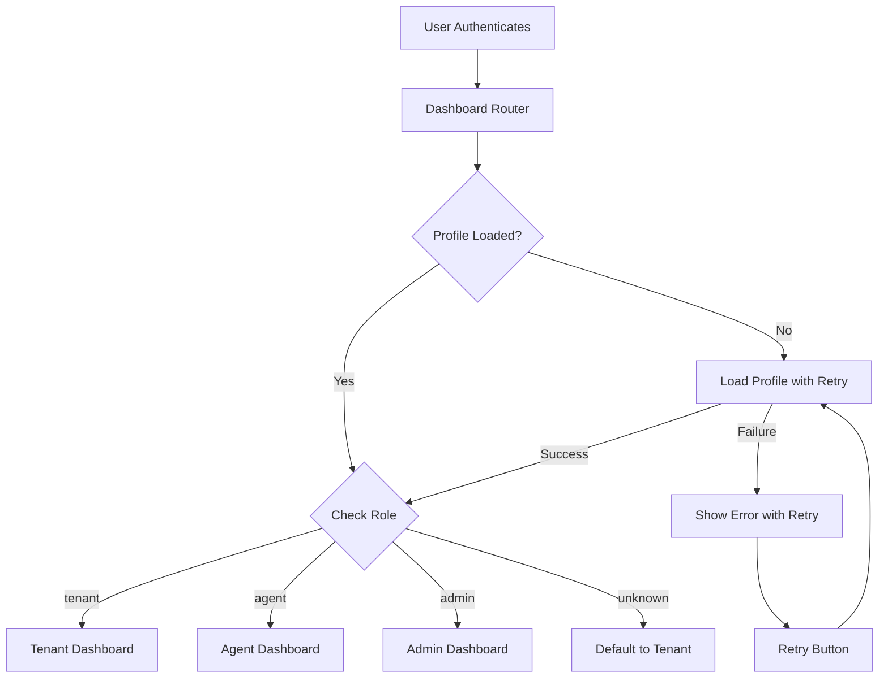

# Design Document

## Overview

The dashboard routing fix will implement a robust role-based routing system that properly handles user authentication, profile loading, and error recovery. The solution will create a centralized routing logic that determines the appropriate dashboard based on user roles and handles edge cases gracefully.

## Architecture

### Current Issues Identified

1. **Profile Loading Failures**: The `getProfile` function in `src/lib/utils/dashboard.ts` creates profiles for new users but doesn't handle all error cases properly
2. **Generic Dashboard Route**: The `/dashboard` route tries to handle all user types in one component, leading to confusion
3. **Error Handling**: When profile loading fails, users are redirected to login instead of showing retry options
4. **Role Detection**: The system doesn't have clear role-based routing logic after authentication

### Proposed Solution

The design will implement a **Dashboard Router Component** that acts as a smart routing layer between authentication and the actual dashboard components.



## Components and Interfaces

### 1. Dashboard Router Component

**Location**: `src/components/DashboardRouter.tsx`

**Purpose**: Central routing logic that determines which dashboard to show based on user role and handles loading/error states.

**Key Features**:
- Profile loading with retry mechanism
- Role-based dashboard selection
- Error boundary for graceful error handling
- Loading states with progress indicators

### 2. Enhanced Profile Loading

**Location**: `src/lib/utils/dashboard.ts` (enhanced)

**Improvements**:
- Better error classification (network vs auth vs data errors)
- Automatic retry logic for transient failures
- Default profile creation with better error handling
- Profile validation and sanitization

### 3. Role-Based Dashboard Components

**Structure**:
- `TenantDashboard.tsx` - Existing DashboardContent with tenant-specific logic
- `AgentDashboard.tsx` - Agent-specific dashboard wrapper
- `AdminDashboard.tsx` - Admin dashboard (already exists at `/admin`)

### 4. Enhanced Error Handling

**Components**:
- `DashboardErrorBoundary.tsx` - Catches and handles dashboard errors
- `ProfileLoadingError.tsx` - Specific error component for profile issues
- `RetryableError.tsx` - Generic retry component for recoverable errors

## Data Models

### Enhanced Profile Interface

```typescript
interface UserProfile {
  id: string
  full_name: string | null
  role: 'tenant' | 'agent' | 'admin'
  agent_status: 'not_applicable' | 'pending_payment' | 'pending_verification' | 'active'
  ecocash_number?: string | null
  phone_number?: string | null
  created_at: string
  updated_at: string
}

interface ProfileLoadingState {
  isLoading: boolean
  error: string | null
  retryCount: number
  canRetry: boolean
  lastAttempt: Date | null
}
```

### Dashboard Route Configuration

```typescript
interface DashboardRoute {
  role: UserProfile['role']
  component: React.ComponentType
  path: string
  requiredStatus?: string[]
  fallbackPath?: string
}
```

## Error Handling

### Error Classification

1. **Network Errors**: Temporary connectivity issues - show retry
2. **Authentication Errors**: Invalid/expired tokens - redirect to login
3. **Profile Errors**: Missing/invalid profile data - attempt creation/retry
4. **Permission Errors**: Insufficient permissions - show appropriate message

### Error Recovery Strategies

1. **Automatic Retry**: For network and transient errors
2. **Profile Creation**: For missing profiles
3. **Graceful Degradation**: Show limited functionality when possible
4. **User-Initiated Retry**: Clear retry buttons for user control

### Error UI Components

- Loading spinners with progress messages
- Error cards with specific error descriptions
- Retry buttons with loading states
- Fallback content when data is unavailable

## Testing Strategy

### Unit Tests

1. **Profile Loading Logic**:
   - Test successful profile loading
   - Test profile creation for new users
   - Test error handling for various failure scenarios
   - Test retry logic and backoff strategies

2. **Dashboard Router**:
   - Test role-based routing decisions
   - Test error state handling
   - Test loading state management
   - Test fallback scenarios

3. **Error Handling**:
   - Test error classification
   - Test retry mechanisms
   - Test error boundary behavior
   - Test user feedback during errors

### Integration Tests

1. **Authentication Flow**:
   - Test complete login to dashboard flow
   - Test role-based dashboard loading
   - Test error recovery scenarios
   - Test session persistence

2. **Profile Management**:
   - Test new user profile creation
   - Test existing user profile loading
   - Test profile update scenarios
   - Test concurrent access handling

### User Experience Tests

1. **Loading States**:
   - Verify loading indicators are shown
   - Test loading message progression
   - Verify smooth transitions between states

2. **Error States**:
   - Test error message clarity
   - Verify retry functionality works
   - Test error recovery user flows

## Implementation Phases

### Phase 1: Core Infrastructure
- Create DashboardRouter component
- Enhance profile loading with retry logic
- Implement error classification system

### Phase 2: Role-Based Routing
- Implement role-based dashboard selection
- Create dashboard-specific components
- Add role validation and fallbacks

### Phase 3: Error Handling
- Implement comprehensive error boundaries
- Add retry mechanisms and user feedback
- Create error recovery flows

### Phase 4: Testing and Polish
- Add comprehensive test coverage
- Optimize loading performance
- Polish user experience and transitions

## Security Considerations

1. **Role Validation**: Always validate user roles server-side
2. **Profile Access**: Ensure users can only access their own profile data
3. **Admin Protection**: Maintain existing admin route protection
4. **Session Security**: Implement proper session validation and refresh

## Performance Considerations

1. **Profile Caching**: Cache profile data to reduce API calls
2. **Lazy Loading**: Load dashboard components only when needed
3. **Error Debouncing**: Prevent rapid retry attempts
4. **Memory Management**: Properly cleanup subscriptions and timers