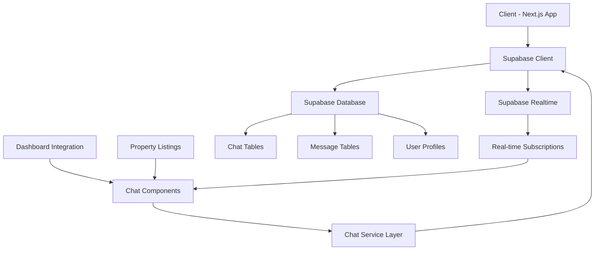
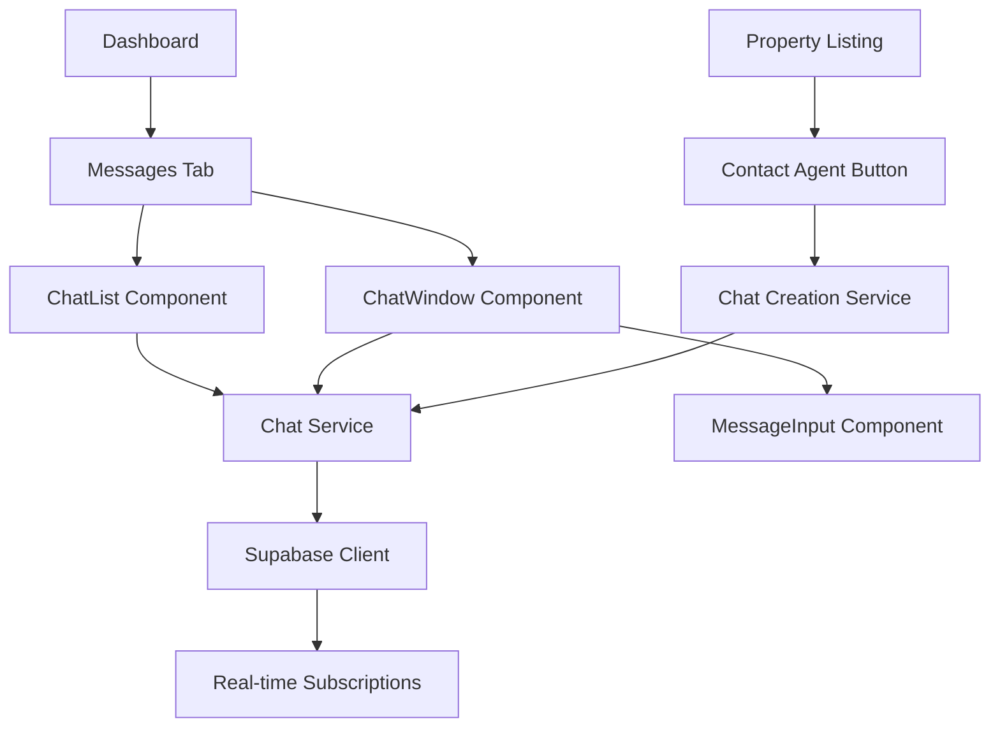

# Design Document

## Overview

The chat system will be implemented as a new feature in the Unistay platform, providing real-time messaging between tenants and property agents. The system will integrate seamlessly with the existing dashboard architecture and leverage Supabase for real-time functionality, authentication, and data persistence.

The chat feature will be accessible through a new "Messages" tab in the dashboard and will also be integrated into property listings to allow direct contact with agents. The system will support both desktop and mobile interfaces with responsive design principles.

## Architecture

### High-Level Architecture



### Database Schema

The chat system will use a simplified two-table approach:

1. **chats** - Stores conversation metadata
2. **messages** - Stores individual messages

### Component Architecture



## Components and Interfaces

### Core Components

#### 1. ChatList Component
- **Purpose**: Display list of user's conversations
- **Props**: 
  - `userId: string`
  - `userRole: 'tenant' | 'agent'`
- **State**:
  - `conversations: Conversation[]`
  - `loading: boolean`
  - `error: string | null`
- **Features**:
  - Real-time updates for new messages
  - Unread message indicators
  - Last message preview
  - Responsive design for mobile/desktop

#### 2. ChatWindow Component
- **Purpose**: Display conversation messages and handle message display
- **Props**:
  - `chatId: string`
  - `currentUserId: string`
- **State**:
  - `messages: Message[]`
  - `otherParticipant: User`
  - `loading: boolean`
  - `typingIndicator: boolean`
- **Features**:
  - Auto-scroll to latest messages
  - Message grouping by sender
  - Timestamp display
  - Typing indicators

#### 3. MessageInput Component
- **Purpose**: Handle message composition and sending
- **Props**:
  - `chatId: string`
  - `onSendMessage: (content: string) => void`
- **State**:
  - `messageContent: string`
  - `sending: boolean`
- **Features**:
  - Auto-resize text input
  - Send on Enter key
  - Character limit validation
  - Retry failed messages

#### 4. ContactAgentButton Component
- **Purpose**: Initiate chat from property listings
- **Props**:
  - `propertyId: string`
  - `agentId: string`
  - `propertyTitle: string`
- **Features**:
  - Create or open existing chat
  - Context-aware messaging
  - Loading states

### Service Layer

#### ChatService
```typescript
interface ChatService {
  // Chat management
  getUserChats(userId: string, userRole: string): Promise<Conversation[]>
  getChatById(chatId: string): Promise<Chat | null>
  createPropertyChat(propertyId: string, agentId: string): Promise<string>
  
  // Message management
  getChatMessages(chatId: string): Promise<Message[]>
  sendMessage(chatId: string, content: string): Promise<Message>
  
  // Real-time subscriptions
  subscribeToChatList(userId: string, callback: (chats: Conversation[]) => void): () => void
  subscribeToChat(chatId: string, callback: (message: Message) => void): () => void
  subscribeToTyping(chatId: string, callback: (isTyping: boolean, userId: string) => void): () => void
}
```

### Data Models

#### Chat Model
```typescript
interface Chat {
  id: string
  property_id: string
  property_title: string
  tenant_id: string
  agent_id: string
  created_at: string
  updated_at: string
}
```

#### Message Model
```typescript
interface Message {
  id: string
  chat_id: string
  sender_id: string
  content: string
  message_type: 'text' // extensible for future file/image support
  created_at: string
  updated_at: string
}
```

#### Conversation Model (for chat list)
```typescript
interface Conversation {
  id: string
  property_title: string
  other_participant: {
    id: string
    full_name: string
    role: 'tenant' | 'agent'
  }
  last_message: {
    content: string
    created_at: string
    sender_id: string
  } | null
  unread_count: number
  created_at: string
}
```

## Data Models

### Database Tables

#### chats table
```sql
CREATE TABLE chats (
  id UUID PRIMARY KEY DEFAULT gen_random_uuid(),
  property_id UUID REFERENCES properties(id) ON DELETE CASCADE NOT NULL,
  property_title VARCHAR(255) NOT NULL,
  tenant_id UUID REFERENCES profiles(id) ON DELETE CASCADE NOT NULL,
  agent_id UUID REFERENCES profiles(id) ON DELETE CASCADE NOT NULL,
  created_at TIMESTAMP WITH TIME ZONE DEFAULT NOW(),
  updated_at TIMESTAMP WITH TIME ZONE DEFAULT NOW(),
  
  -- Ensure one chat per property-tenant pair
  CONSTRAINT unique_chat_per_property_tenant UNIQUE (property_id, tenant_id)
);
```

#### messages table
```sql
CREATE TABLE messages (
  id UUID PRIMARY KEY DEFAULT gen_random_uuid(),
  chat_id UUID REFERENCES chats(id) ON DELETE CASCADE NOT NULL,
  sender_id UUID REFERENCES profiles(id) ON DELETE CASCADE NOT NULL,
  content TEXT NOT NULL,
  message_type VARCHAR(20) DEFAULT 'text' CHECK (message_type IN ('text')),
  created_at TIMESTAMP WITH TIME ZONE DEFAULT NOW(),
  updated_at TIMESTAMP WITH TIME ZONE DEFAULT NOW()
);
```

### Database Views

#### chat_conversations view
```sql
CREATE VIEW chat_conversations AS
SELECT 
  c.id,
  c.property_id,
  c.property_title,
  c.tenant_id,
  c.agent_id,
  c.created_at,
  c.updated_at,
  t.full_name as tenant_name,
  a.full_name as agent_name,
  (
    SELECT json_build_object(
      'content', m.content,
      'created_at', m.created_at,
      'sender_id', m.sender_id
    )
    FROM messages m
    WHERE m.chat_id = c.id
    ORDER BY m.created_at DESC
    LIMIT 1
  ) as last_message,
  (
    SELECT COUNT(*)
    FROM messages m
    WHERE m.chat_id = c.id
    AND m.sender_id != auth.uid()
    AND m.created_at > COALESCE(
      (SELECT last_read_at FROM chat_read_status WHERE chat_id = c.id AND user_id = auth.uid()),
      '1970-01-01'::timestamp
    )
  ) as unread_count
FROM chats c
JOIN profiles t ON t.id = c.tenant_id
JOIN profiles a ON a.id = c.agent_id
WHERE c.tenant_id = auth.uid() OR c.agent_id = auth.uid();
```

## Error Handling

### Client-Side Error Handling

1. **Network Errors**
   - Display user-friendly error messages
   - Implement retry mechanisms for failed requests
   - Queue messages locally when offline

2. **Authentication Errors**
   - Redirect to login when session expires
   - Handle unauthorized access gracefully

3. **Validation Errors**
   - Real-time input validation
   - Clear error messaging for invalid data

### Server-Side Error Handling

1. **Database Errors**
   - Proper error logging
   - Graceful degradation for read operations
   - Transaction rollback for write operations

2. **Authorization Errors**
   - Row Level Security (RLS) policies
   - Proper error responses without data leakage

### Error Recovery Strategies

1. **Message Sending Failures**
   - Retry mechanism with exponential backoff
   - Local message queuing
   - Clear failure indicators with retry options

2. **Real-time Connection Issues**
   - Automatic reconnection attempts
   - Fallback to polling when WebSocket fails
   - Connection status indicators

## Testing Strategy

### Unit Testing

1. **Component Testing**
   - Test component rendering with various props
   - Test user interactions (clicking, typing)
   - Test error states and loading states
   - Mock external dependencies (Supabase)

2. **Service Layer Testing**
   - Test chat service methods
   - Test error handling scenarios
   - Test data transformation logic
   - Mock database responses

### Integration Testing

1. **Database Integration**
   - Test RLS policies with different user roles
   - Test database functions and triggers
   - Test real-time subscription behavior

2. **Component Integration**
   - Test chat flow from property listing to conversation
   - Test real-time message updates
   - Test responsive behavior across devices

### End-to-End Testing

1. **User Workflows**
   - Tenant initiating chat from property listing
   - Agent responding to tenant messages
   - Real-time message delivery
   - Mobile responsive behavior

2. **Error Scenarios**
   - Network disconnection during chat
   - Authentication expiration
   - Database unavailability

### Performance Testing

1. **Load Testing**
   - Multiple concurrent users
   - High message volume scenarios
   - Real-time subscription scalability

2. **Mobile Performance**
   - Touch responsiveness
   - Scroll performance with large message history
   - Battery usage optimization

### Security Testing

1. **Authorization Testing**
   - Verify RLS policies prevent unauthorized access
   - Test cross-tenant data isolation
   - Validate input sanitization

2. **Data Privacy**
   - Ensure messages are only visible to participants
   - Test secure message transmission
   - Validate proper session management