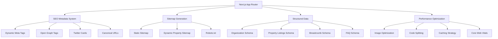
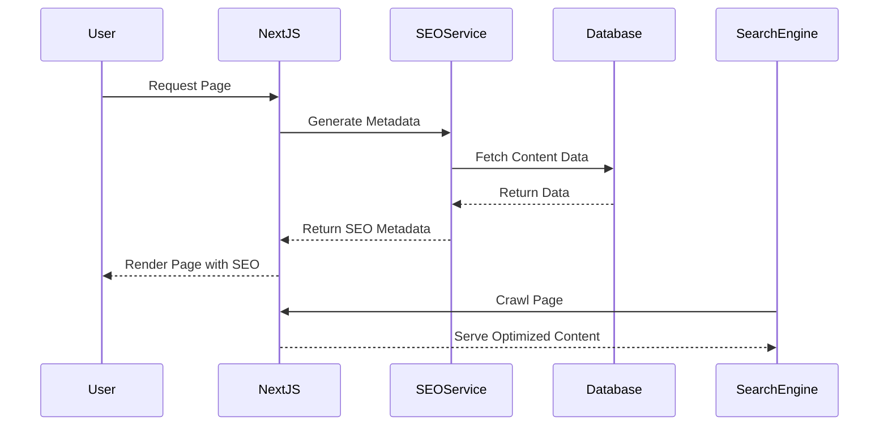

# SEO Optimization Design Document

## Overview

This design implements comprehensive SEO optimization for the Unistay platform using Next.js 15's App Router architecture. The solution leverages Next.js built-in SEO features, implements structured data, optimizes performance, and provides content management capabilities for SEO metadata.

The design focuses on both technical SEO fundamentals and user experience factors that impact search rankings, specifically tailored for a student accommodation marketplace.

## Architecture

### Core SEO Components



### SEO Data Flow



## Components and Interfaces

### 1. SEO Metadata Service

**Purpose:** Centralized service for generating dynamic SEO metadata

```typescript
interface SEOMetadata {
  title: string;
  description: string;
  keywords?: string[];
  canonical?: string;
  openGraph: OpenGraphData;
  twitter: TwitterCardData;
  structuredData?: StructuredData[];
}

interface SEOService {
  generateMetadata(pageType: string, data: any): Promise<SEOMetadata>;
  generatePropertyMetadata(property: Property): Promise<SEOMetadata>;
  generateLocationMetadata(location: Location): Promise<SEOMetadata>;
  validateMetadata(metadata: SEOMetadata): ValidationResult;
}
```

### 2. Structured Data Generator

**Purpose:** Generate JSON-LD structured data for different content types

```typescript
interface StructuredDataGenerator {
  generateOrganizationSchema(): OrganizationSchema;
  generatePropertySchema(property: Property): RealEstateListingSchema;
  generateBreadcrumbSchema(breadcrumbs: Breadcrumb[]): BreadcrumbSchema;
  generateFAQSchema(faqs: FAQ[]): FAQPageSchema;
}
```

### 3. Sitemap Generator

**Purpose:** Generate XML sitemaps for static and dynamic content

```typescript
interface SitemapGenerator {
  generateStaticSitemap(): Promise<SitemapEntry[]>;
  generatePropertySitemap(): Promise<SitemapEntry[]>;
  generateLocationSitemap(): Promise<SitemapEntry[]>;
  generateFullSitemap(): Promise<string>;
}
```

### 4. Performance Monitor

**Purpose:** Track and optimize Core Web Vitals

```typescript
interface PerformanceMonitor {
  trackCoreWebVitals(): void;
  optimizeImages(images: ImageData[]): Promise<OptimizedImage[]>;
  generateCriticalCSS(route: string): Promise<string>;
  preloadCriticalResources(route: string): PreloadDirective[];
}
```

## Data Models

### SEO Configuration

```typescript
interface SEOConfig {
  siteName: string;
  siteUrl: string;
  defaultTitle: string;
  defaultDescription: string;
  defaultKeywords: string[];
  socialMedia: {
    twitter: string;
    facebook: string;
    instagram: string;
  };
  analytics: {
    googleAnalyticsId: string;
    googleSearchConsoleId: string;
  };
}
```

### Property SEO Data

```typescript
interface PropertySEOData {
  id: string;
  title: string;
  description: string;
  location: {
    city: string;
    area: string;
    coordinates: [number, number];
  };
  features: string[];
  price: number;
  images: string[];
  lastModified: Date;
  slug: string;
}
```

### Page Metadata Template

```typescript
interface PageMetadataTemplate {
  pageType: 'home' | 'property' | 'location' | 'search' | 'static';
  titleTemplate: string;
  descriptionTemplate: string;
  keywordPatterns: string[];
  structuredDataTypes: string[];
}
```

## Implementation Strategy

### 1. Next.js App Router Integration

- **Metadata API:** Use Next.js 15's `generateMetadata` function for dynamic meta tags
- **Static Generation:** Leverage ISR for property pages with SEO optimization
- **Route Handlers:** Create API routes for sitemap and robots.txt generation
- **Layout Optimization:** Implement SEO-friendly layouts with proper heading hierarchy

### 2. Dynamic Metadata Generation

- **Property Pages:** Generate unique titles and descriptions based on property data
- **Location Pages:** Create location-specific metadata for city and area pages
- **Search Pages:** Optimize search result pages with relevant keywords
- **User-Generated Content:** Handle SEO for reviews and user profiles

### 3. Structured Data Implementation

- **Organization Schema:** Implement business information schema
- **Real Estate Listings:** Add property-specific structured data
- **Local Business:** Include location and contact information
- **Review Schema:** Implement review and rating structured data

### 4. Performance Optimization

- **Image Optimization:** Use Next.js Image component with WebP/AVIF formats
- **Code Splitting:** Implement route-based and component-based splitting
- **Caching Strategy:** Configure appropriate cache headers and ISR
- **Critical Resource Loading:** Preload fonts, critical CSS, and above-the-fold images

## Error Handling

### SEO Error Types

```typescript
enum SEOErrorType {
  METADATA_VALIDATION_ERROR = 'metadata_validation_error',
  SITEMAP_GENERATION_ERROR = 'sitemap_generation_error',
  STRUCTURED_DATA_ERROR = 'structured_data_error',
  PERFORMANCE_THRESHOLD_ERROR = 'performance_threshold_error'
}

interface SEOError {
  type: SEOErrorType;
  message: string;
  context: any;
  severity: 'low' | 'medium' | 'high' | 'critical';
}
```

### Error Handling Strategy

1. **Graceful Degradation:** Ensure pages render even if SEO metadata generation fails
2. **Fallback Metadata:** Provide default meta tags when dynamic generation fails
3. **Error Logging:** Log SEO errors for monitoring and debugging
4. **Validation Warnings:** Warn about suboptimal SEO configurations without breaking functionality

## Testing Strategy

### 1. SEO Testing Framework

```typescript
interface SEOTestSuite {
  validateMetadata(url: string): Promise<MetadataValidationResult>;
  checkStructuredData(url: string): Promise<StructuredDataValidationResult>;
  auditPerformance(url: string): Promise<PerformanceAuditResult>;
  validateSitemap(): Promise<SitemapValidationResult>;
}
```

### 2. Test Categories

- **Metadata Tests:** Validate title length, description length, and required tags
- **Structured Data Tests:** Verify JSON-LD schema validity and completeness
- **Performance Tests:** Check Core Web Vitals thresholds
- **Crawlability Tests:** Ensure proper robots.txt and sitemap accessibility
- **Mobile Optimization Tests:** Validate mobile-friendly implementation

### 3. Automated Testing

- **Pre-deployment Checks:** Run SEO audits before production deployment
- **Continuous Monitoring:** Regular performance and SEO health checks
- **Regression Testing:** Ensure SEO improvements don't break existing functionality
- **A/B Testing:** Test different meta tag variations for optimization

### 4. Integration Testing

- **Search Console Integration:** Verify proper data submission to Google Search Console
- **Analytics Integration:** Ensure organic traffic tracking works correctly
- **Social Media Integration:** Test Open Graph and Twitter Card rendering
- **Third-party Tools:** Validate compatibility with SEO analysis tools

## Security Considerations

### 1. Content Security Policy (CSP)

- Configure CSP headers to allow structured data and analytics scripts
- Ensure social media meta tags don't introduce XSS vulnerabilities
- Validate user-generated content used in meta descriptions

### 2. Data Privacy

- Implement proper consent management for analytics tracking
- Ensure GDPR compliance for user data in structured data
- Protect sensitive property information in public metadata

### 3. Rate Limiting

- Implement rate limiting for sitemap generation endpoints
- Protect against automated scraping of SEO data
- Monitor for unusual crawling patterns

## Monitoring and Analytics

### 1. SEO Metrics Dashboard

- **Search Rankings:** Track keyword positions and visibility
- **Organic Traffic:** Monitor search engine traffic and conversions
- **Core Web Vitals:** Real-time performance monitoring
- **Crawl Errors:** Track and alert on crawling issues

### 2. Performance Monitoring

- **Page Speed Insights:** Regular Core Web Vitals audits
- **Search Console Data:** Monitor indexing status and search performance
- **Schema Validation:** Continuous structured data validation
- **Broken Link Detection:** Automated link health monitoring

### 3. Reporting and Alerts

- **Weekly SEO Reports:** Automated performance summaries
- **Critical Issue Alerts:** Immediate notifications for SEO problems
- **Ranking Change Notifications:** Alerts for significant ranking changes
- **Performance Degradation Warnings:** Proactive performance issue detection